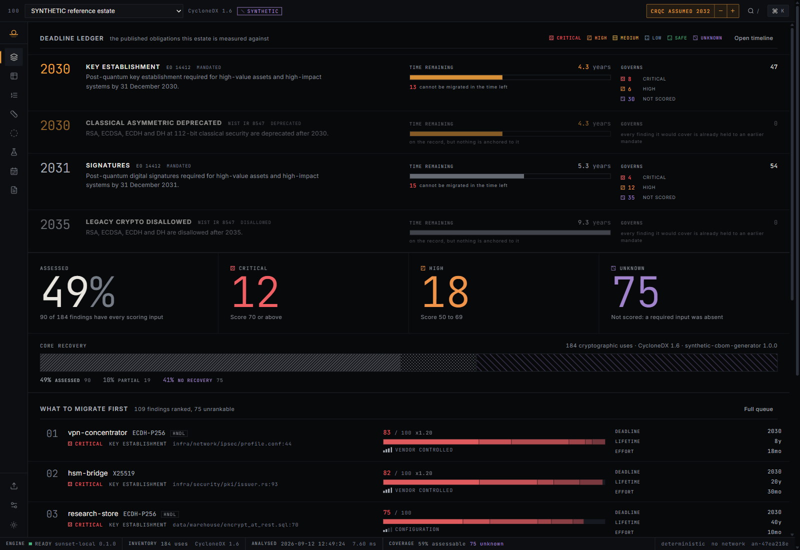
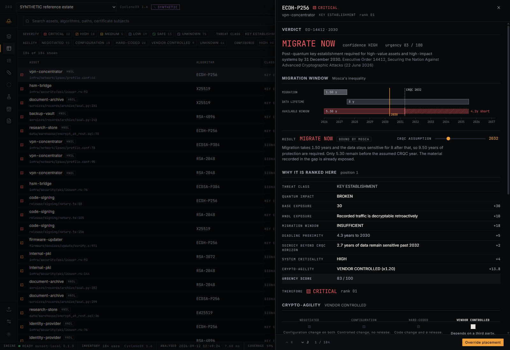
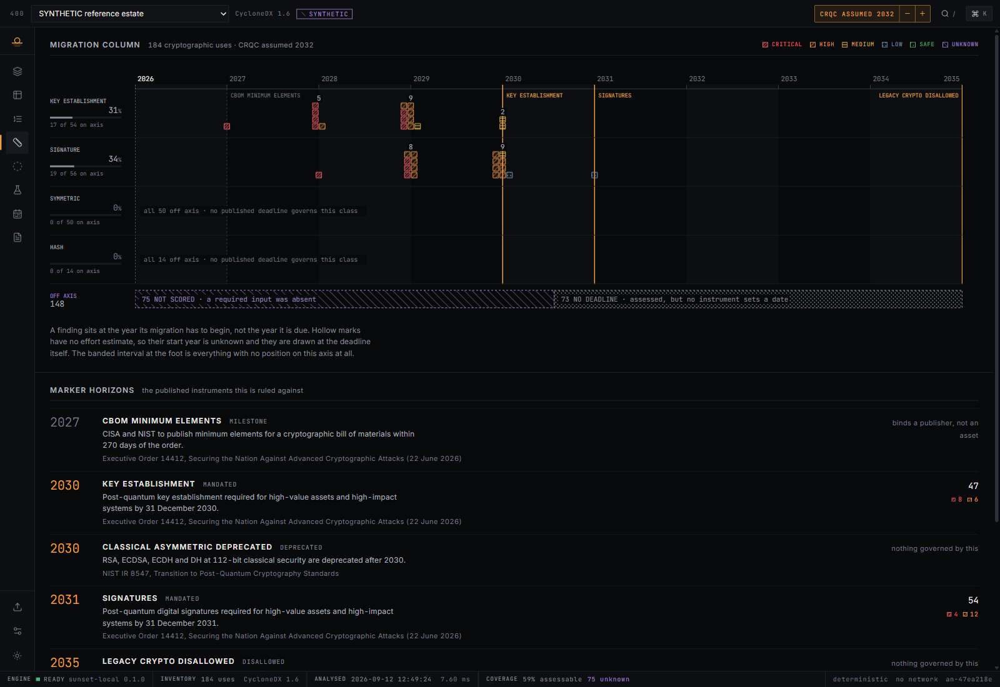
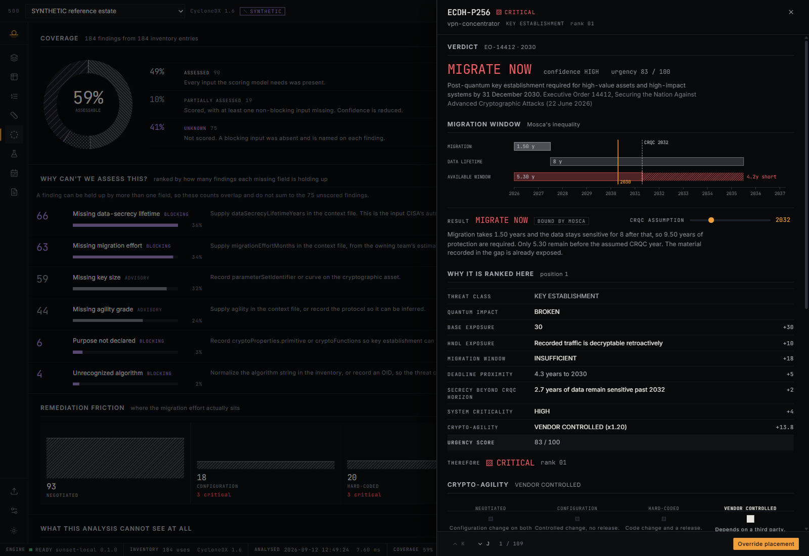
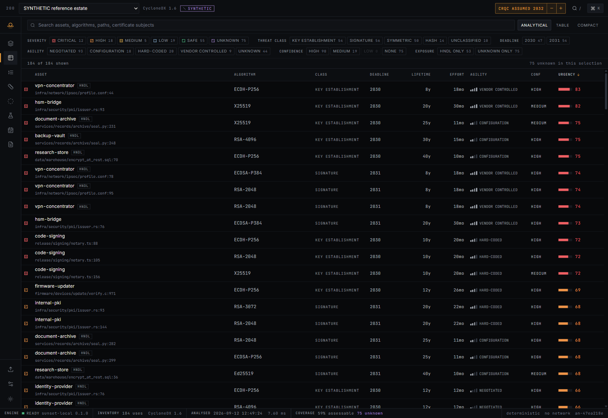
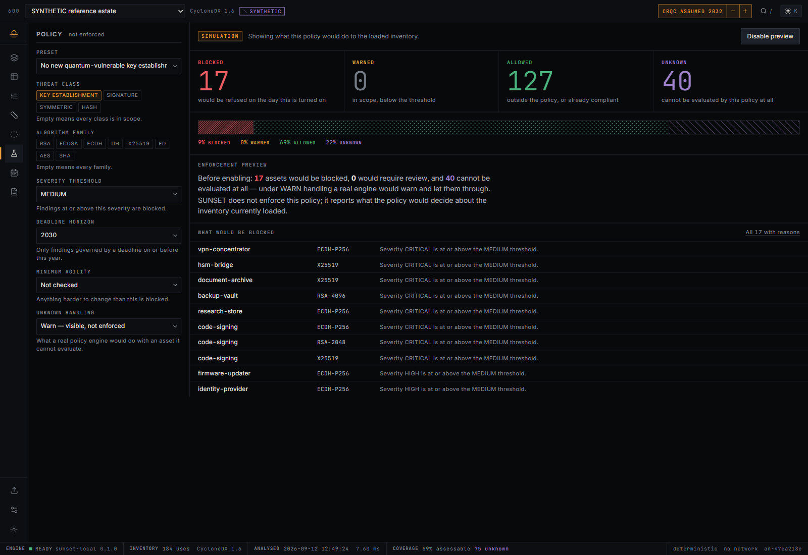
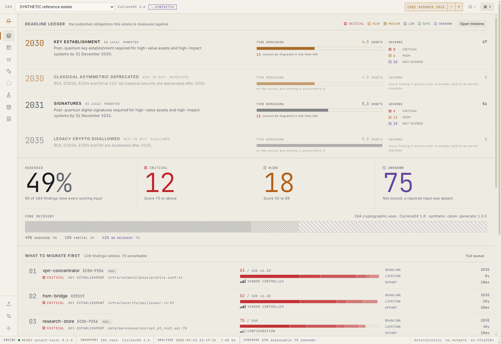

<div align="center">

# SUNSET

### Know what expires. Know what to migrate first.

**A cryptographic posture and post-quantum migration triage console.**
It turns an inventory into a deadline-anchored, risk-ranked plan — and states plainly what it could not assess.

[](https://github.com/het-P301204/sunset/actions/workflows/ci.yml)
[](LICENSE)
[](package.json)
[](#trust-boundary)
[](#determinism)



</div>

---

## The one-paragraph version

Cryptographic **discovery** is a solved problem. Scanners will hand you every RSA key in your estate, and CycloneDX 1.6 gives the output a schema. What none of them tell you is **what to migrate first** — and that gap is not an oversight.

The prioritisation model everyone agrees on is **Mosca's inequality**:

> **T**<sub>migrate</sub> + **T**<sub>data secrecy lifetime</sub> > **T**<sub>CRQC</sub> → *you are already too late*

Two lines of arithmetic. The difficulty is that **neither input on the left can be discovered by scanning**. CISA's own automated-PQC-discovery strategy says so in as many words: most of the nine inventory data items it defines *"cannot be detected or collected using currently available automated tools, and therefore, are manually collected"* — and the non-automatable list explicitly includes **how long the data needs protection**, which is exactly `T`<sub>data secrecy lifetime</sub>.

So any tool that reports a confident priority order over a scanned inventory has either asked a human for those values, or invented them.

**SUNSET asks. And where the answer is absent, it returns `UNKNOWN` and names the missing field** — rather than substituting a plausible default that produces a plausible ranking nobody can defend in a review.

---

## The thesis, in one screenshot

Load the sample estate, then switch the inventory selector to **"discovery only"** — the same CBOM with no human-supplied context.

| | Full inventory | Discovery only |
|---|---:|---:|
| Findings | 184 | 184 |
| **Assessed** | **49%** | **16%** |
| Critical | 12 | 0 |
| High | 18 | 0 |
| **Not scored** | **75** | **111** |

Same estate. Same scanner. The second column is what a discovery tool on its own can honestly tell you. That collapse is the product's entire argument, and it is computed live — not a slide.

---

## What it does

<table>
<tr><td width="50%" valign="top">

**Reads**
- CycloneDX 1.6 **CBOM**
- Repository crypto-discovery export
- SUNSET **context file** — the facts no scanner can collect

**Understands**
- Normalises algorithm spellings across formats
- Decomposes cipher suites into separate migration decisions
- Classifies by threat class and quantum impact (Shor / Grover / FIPS 203–205)

</td><td width="50%" valign="top">

**Decides**
- Anchors each finding to its **governing published obligation**, quoted and cited
- Evaluates **Mosca** per asset and reports which constraint binds
- Grades **crypto-agility** and weights by remediation friction
- Produces a queue where every position is explainable in one screen

**Reports**
- Coverage broken down by the exact field that blocked each finding
- Policy **simulation** that enforces nothing
- PDF / JSON / CSV carrying the analysis id and the assumptions

</td></tr>
</table>

### What it deliberately does not do

It implements **no cryptography**. It does not scan, discover, connect to anything, or block anything. Every enforcement view is labelled `SIMULATION` and stays that way.

---

## Screens

<details open>
<summary><b>The finding drawer</b> — why this is ranked #1, in one screen</summary>
<br>



Mosca drawn to scale — migration, data lifetime, and the available window, with the shortfall hatched. Below it, **every term that produced the score**, in the order it was applied. No model, no weighting matrix nobody can read. If you disagree with the position, this tells you exactly which line to argue with.

</details>

<details>
<summary><b>The sunset timeline</b> — plotted by when work must <i>start</i></summary>
<br>



A stratigraphic column laid on its side. The x-axis is the year migration must **begin** — deadline minus effort — because a fourteen-month migration due in 2030 starts in 2028, and a chart that plots it at 2030 has told you the comfortable half of the truth.

The `OFF AXIS` band at the foot is drawn to scale and never omitted, split into the two reasons that are not the same thing: **NOT SCORED** (an input was absent) and **NO DEADLINE** (assessed, but no instrument sets a date).

</details>

<details>
<summary><b>Coverage</b> — the screen most tools do not have</summary>
<br>



Ranked by how many findings each missing field is holding up, so the top row is the one that moves the number most. Every row names a **field**, not a feeling.

</details>

<details>
<summary><b>Inventory explorer</b></summary>
<br>



A real `<table>` — semantic rows, sticky header, `aria-sort`, full keyboard traversal, and windowed rendering past a few hundred rows. Three densities. Filters show the count each would leave behind.

</details>

<details>
<summary><b>Policy simulation</b></summary>
<br>



The fourth counter is the point. A real policy engine has to decide what to do with an asset it cannot evaluate, and every option is wrong in a different way. `UNKNOWN` is always counted **separately** — never folded into blocked or allowed — and the reason line says what a real engine would do under the configured handling.

</details>

<details>
<summary><b>Light theme</b> — a separate design, not an inversion</summary>
<br>



The same core log printed on buff paper. Every ink role is re-tuned for the lighter ground and carries its measured contrast ratio in the token file.

</details>

---

## Quick start

```bash
git clone https://github.com/het-P301204/sunset.git
cd sunset
npm install
npm run dev
```

Open the address Vite prints, then click **Load the sample estate**.

```bash
npm run build      # typecheck + production build into dist/
npm run preview    # serve the production build
npm test           # 44 tests over the engine, parser and exports
npm run typecheck
```

`dist/` is a static bundle with relative asset paths and self-hosted fonts. Serve it from anywhere, or open it off a file share.

---

## The deadlines

Every date is a citation. Nothing is estimated or extrapolated.

| Date | Obligation | Instrument |
|---|---|---|
| 19 Mar 2027 | CISA and NIST to publish CBOM minimum elements (within 270 days of the order) | EO 14412 |
| **31 Dec 2030** | **Post-quantum key establishment** for high-value assets and high-impact systems | EO 14412 |
| 31 Dec 2030 | RSA, ECDSA, ECDH, DH at 112-bit classical security **deprecated** | NIST IR 8547 |
| **31 Dec 2031** | **Post-quantum signatures** for high-value assets and high-impact systems | EO 14412 |
| 31 Dec 2035 | RSA, ECDSA, ECDH, DH **disallowed** | NIST IR 8547 |

Symmetric ciphers and hashes have **no entry**, deliberately. Neither instrument sets a post-quantum migration date for them, Grover reduces a margin rather than breaking anything, and recorded material does not become readable later. SUNSET anchors those findings to no deadline and says so on screen, rather than inventing an obligation.

> Two corrections the build forced, both worth knowing:
>
> **Deadline precedence is effect-first, not year-first.** Two instruments land on 2030. Sorting by year anchors every signature finding to the 2030 *deprecation* instead of the 2031 *mandate* — reporting an obligation that does not exist.
>
> **Mosca governs only what a CRQC breaks.** Applying it to Grover-weakened AES or SHA manufactures false `UNKNOWN`s: recorded symmetric material is not retroactively readable, so data-secrecy lifetime is not what decides its replacement date.

### The CRQC horizon is an input, not a constant

Every urgency number depends on an assumed year for a cryptographically relevant quantum computer. **Nobody knows that year.** So it sits adjustable in the top bar of every screen, appears in the evidence chain of every finding, is printed in every export, and is draggable inside the Mosca diagram itself. Move it and watch the queue re-order.

---

## How the score works

Additive and deterministic, so every point can be shown as a line in the evidence chain.

| Term | Weight |
|---|---|
| Base exposure — key establishment, broken | 30 |
| Base exposure — signature, broken | 24 |
| Base exposure — symmetric / hash, weakened | 6 / 5 |
| HNDL exposure | +10 |
| Migration window insufficient / tight | +18 / +9 |
| Deadline proximity | 0 → +9 *(+12 if passed)* |
| Secrecy beyond the CRQC horizon | 0 → +8 |
| Already broken classically | +12 |
| Key size below the family floor | +7 |
| System criticality — HVA / high / moderate | +7 / +4 / +2 |
| **Crypto-agility multiplier** | **×0.88 → ×1.20** |

Bands: `CRITICAL ≥ 70` · `HIGH ≥ 50` · `MEDIUM ≥ 30` · `LOW ≥ 12`.

Key establishment outranks signatures at the base because the exposure is **retroactive** — a recorded handshake is decryptable later; a signature made today is not forgeable later.

> ### The rule the whole product turns on
> **A finding with a missing blocking input scores `null`, not zero.**
>
> A zero sorts to the bottom of the queue and reads as *safe*, which is the exact failure this tool exists to prevent. Unscored findings are unranked, tabbed separately, counted separately, and exported in full.

---

## Architecture

```
src/
├─ types/domain.ts      the contract between engine and interface
├─ engine/              deterministic analysis — no DOM, no React
│  ├─ deadlines.ts        the citation table
│  ├─ algorithms.ts       recognition and normalisation
│  ├─ classify.ts         threat class and quantum impact
│  ├─ mosca.ts            the inequality
│  ├─ agility.ts          remediation friction
│  ├─ score.ts            urgency, severity, verdict, confidence
│  ├─ coverage.ts         what was and was not assessed
│  ├─ rank.ts             ordering and engine-recommended scheduling
│  ├─ simulate.ts         policy evaluation
│  ├─ sanitize.ts         the untrusted-input boundary
│  └─ parse/              CycloneDX · repo scan · context
├─ adapters/engine.ts   the only module components import the engine through
├─ state/               store · selectors · persistence · view registry · theme
├─ components/          shell · dashboard · inventory · analysis · coverage
│                       simulation · plan · reports · import · shared
├─ export/report.ts     one model feeding the preview, PDF, JSON and CSV
└─ fixtures/            synthetic inventories, labelled at the source
```

Components **never** import from `src/engine/**`. They call `src/adapters/engine.ts`, whose surface is async even though the local implementation is synchronous — so replacing it with a worker, a WASM build or a service is a one-file change, not a component rewrite.

**Stack:** Vite · React 18 · TypeScript (strict, `noUncheckedIndexedAccess`) · Tailwind. Three runtime dependencies: `react`, `react-dom`, `lucide-react`. **No charting library** — every visualisation is hand-drawn SVG. Fonts are self-hosted `woff2`, because a CDN link would contradict the offline claim on the first page load.

### Determinism

The same inventory with the same assumptions produces a byte-identical ranking and the same analysis id, every run. No clock reads inside the scoring loop, no `Math.random`, no dependence on `Map` iteration order. A ranking that drifts between runs is worthless in a review meeting — so the test suite asserts it does not.

---

## Trust boundary

An imported inventory is a JSON document produced by a scanner someone else ran against a codebase someone else wrote. It is **data, never instructions**, and everything crossing that line goes through `src/engine/sanitize.ts`.

| Concern | Handling |
|---|---|
| Script injection through inventory strings | No `dangerouslySetInnerHTML` anywhere; all inventory content renders as React text nodes |
| Control characters and **bidi overrides** | Stripped — a right-to-left override inside a filename can make a rendered path read as something it is not |
| Prototype pollution via inventory keys | `__proto__`, `constructor`, `prototype` refused; attribute records built on a null-prototype object |
| Resource exhaustion | Components capped at 20 000, nesting at depth 12, cipher suites at 64/protocol, strings at 400 chars, files at 24 MB |
| Path disclosure in shared reports | Drive letters and `/home/<user>/` prefixes dropped; only the last four path segments kept |
| CSV formula injection | Cells beginning `=` `+` `-` `@` tab or CR are prefixed; delimiters quoted |
| Corrupt or hand-edited `localStorage` | Every persisted value re-validated against an allow-list on read |

**Nothing leaves the page.** No network request at any point, no credentials, no telemetry. The **inventory and its analysis are never persisted** — a cryptographic inventory is a list of an organisation's weakest points, and there is no reason for it to outlive the tab that analysed it. Only settings, assumptions and operator overrides reach storage, and no inventory content ever enters the URL.

See [SECURITY.md](SECURITY.md).

---

## Honest about the sample data

Everything in `src/fixtures/` is **synthetic**, generated by `scripts/generate-fixtures.py` with a fixed seed. No real estate, no real scan, no real organisation.

Two rules keep that honest, and both are enforced in code rather than stated in a doc:

1. Every inventory built from that directory carries `synthetic: true`.
2. The shell renders a persistent `SYNTHETIC` marker whenever that flag is set, and every generated report carries it in the header. **There is no view or export in which fixture output can be mistaken for a real result.**

The fixtures also go through the *real* parser rather than being committed as pre-parsed objects — so a parser bug shows up in development instead of hiding behind hand-written data.

---

## Operating it

| Key | Action |
|---|---|
| `G` then `O` `I` `R` `T` `C` `S` `P` `E` | Overview · Inventory · Triage · Timeline · Coverage · Simulation · Plan · Reports |
| `Ctrl`/`Cmd` + `K` | Command palette — views, filters, actions, and live inventory search |
| `/` | Search the inventory |
| `J` / `K` | Next / previous finding **without closing the drawer** |
| `?` | Legend — every hatch, mark and grade |
| `Esc` | Close the panel |

Every view also carries a three-digit address (`100` Overview, `200` Inventory …) that is typeable in the palette.

### Accessibility

Treated as a product requirement, not a checklist.

- **Severity is encoded by hatch pattern before colour**, with ordinal density. The ranking survives a grayscale print, a projector and a reader with deuteranopia — with no parallel "accessible mode" to maintain.
- All four ink roles clear **4.5:1** on their own ground in **both** themes; the measured ratios are recorded beside the values in `tokens.css`.
- Full keyboard operation including the table and the timeline; one visible focus treatment everywhere.
- Real dialogs — focus traps, `Escape`, restored focus. Semantic `<table>` with `aria-sort`.
- `prefers-reduced-motion` honoured, plus an independent in-product setting. Neither overrides the other.

---

## Design

The visual world is **a core log** — a geologist's borehole record. Not a theme: a set of disciplines that happen to solve this product's problems.

- A real core log **draws the rock it failed to recover**, hatched, with its own percentage. That is `UNKNOWN` as a first-class state, solved by a century-old convention.
- Geological logs **hatch rather than colour**, because they get photocopied. That is the severity encoding.
- **Marker horizons** — a named bed traced across every log — are the deadline rules.
- **Recovery per run**, not just per hole, is the per-class figure in the timeline's margin.

Tokens, type ramp, spacing, motion and the named rules are recorded in **[DESIGN.md](DESIGN.md)**.

---

## Testing

44 tests across three suites, chosen for the claims they hold up rather than for coverage percentage:

- **Determinism** — identical inputs give an identical ranking and id
- **Refusal** — a missing blocking input yields `null`, never a default; unscored findings are never ranked
- **Anchoring** — signatures hit the 2031 *mandate*, not the 2030 *deprecation*; no year is double-counted
- **Simulation** — an unclassified finding is never called "out of scope"; unknowns are never folded into blocked or warned
- **Sanitisation** — bidi and control stripping, path reduction, prototype-key refusal, bounded operator estimates
- **Export** — every export carries the assumptions; CSV neutralises formula injection

```bash
npm test
```

---

## Status and scope

Built as a focused portfolio project: one clear idea, implemented end to end. The engine is real, tested and deterministic; the interface is the deliverable rather than a wrapper around it.

**Not done, and the obvious next passes:** diffing two inventories over time to show migration progress, and walking the CBOM dependency graph so a certificate chain can be assessed as a chain rather than certificate by certificate.

---

<div align="center">

**SUNSET** · offline analysis engine · no credentials · no network · deterministic · inventory-driven

Apache-2.0 · [LICENSE](LICENSE)

</div>
